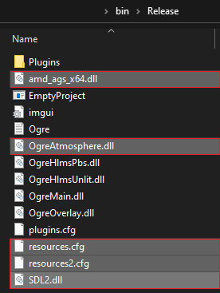

[//]: # (![Alt text]&#40;./Screenshots/pjatk/Logo_EN_1.png "Cookie Engine Screen"&#41;)
# Cookie Engine :cookie: - Game Engine implementation using OGRE renderer
Wojciech Czerski - PJAIT - Engineering Thesis

## What it is?
Hobby project.\
Simplified "game engine" created with Ogre-next bleeding edge renderer with ImGui as editor UI.
Works with OpenGL and DirectX. This is a complete base made of HDR-MSAA sample showing potential possibilities
of creating own game engine. 

### Purpose
Created for an engineering thesis and research purposes, based on this project. MIT license.

### Usage
You want to create your own game engine, don't know where to start, how to use graphics API, backend systems etc.\
This is a extendable project where you can implement your own UI, game logic, styles, layers and
go further like adding scene loader. Easy to use, includes a lot of samples from which you can understand how it works.

### Future
I'm planning to continue this project adding more logic to it, 
so it can became fully called Game Engine (as the goal is to create games with it).\
Upcoming features :
- Extended & Fixed Actor Transform
- Variations of different Scene Objects
- Loading custom textures, meshes
- Full Task Bar options (Save, Undo, Redo)
- Scene Loading/Saving
- Physics Engine (like Bullet or PhysX)
- Debugger

## How to install?
Create folder where you want to keep project, for example 
> root/..

Create Dependencies folder where you keep all additional libraries.
> root/Dependencies/..

Move there downloaded libraries ImGui, OGRE-next.

### OGRE

For OGRE and it's dependencies do build with this tutorial step-by-step

https://ogrecave.github.io/ogre-next/api/latest/_setting_up_ogre_windows.html#BuildingOgreWindows

Include SDL2 build library to Release folder in bin.\..\
To run DirectX add amd_ags_x64.dll\
Add Ogre Atmosphere.dll, resource.cfg to bin\release\..\

Clear %AppData%/CookiEngine to clear run config witf resource.cfg

### ImGui

Works out-of-the-box. If not, please add CMakeLists with ImGui lib definition to Dependencies folder.
Then include it in main CMakeLists.

### Special thanks
For creating imgui integration files and implementation:
https://github.com/edherbert/ogre-next-imgui

### Execution build

After proper installation hit compile on release version. 
For more info / errors fix ping me.

