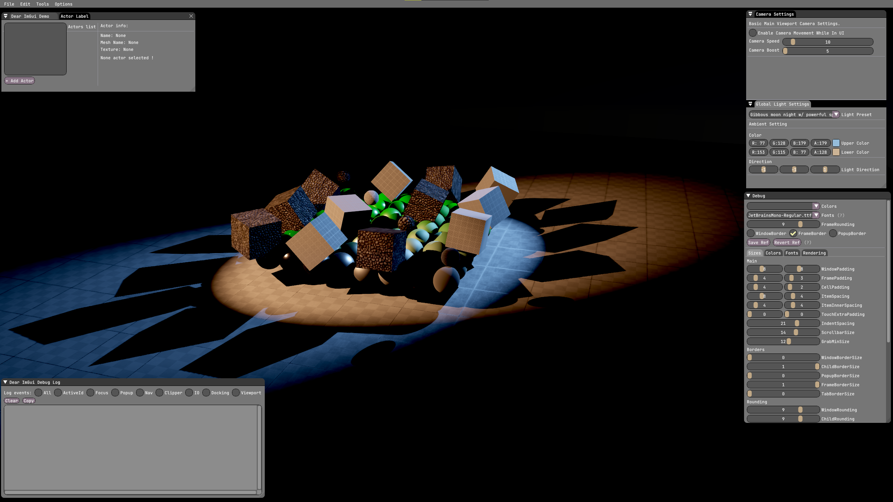
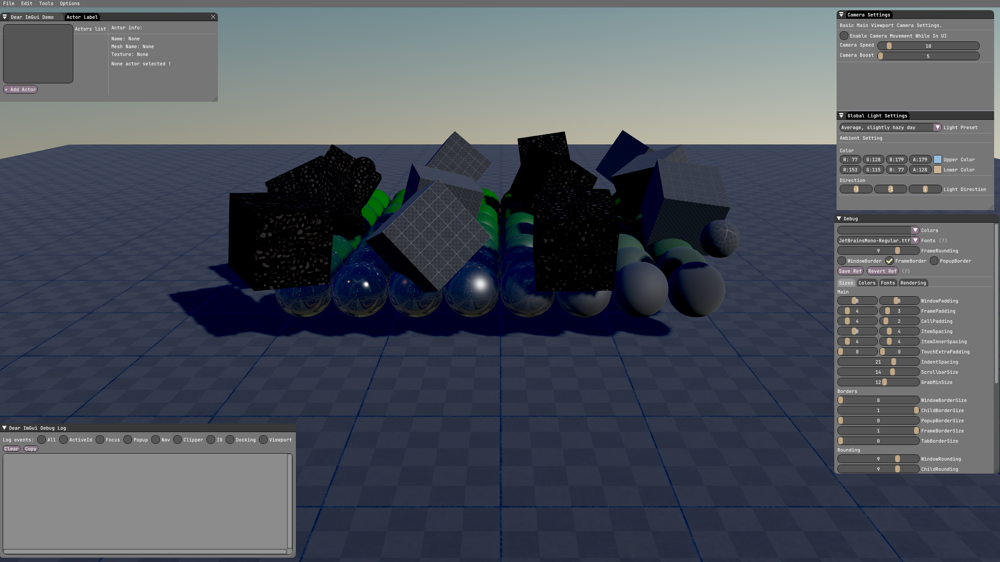
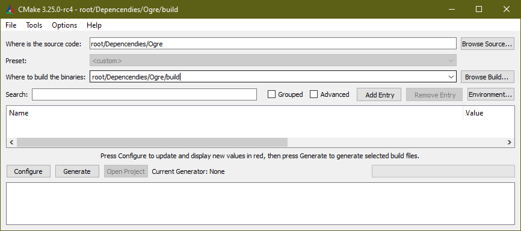
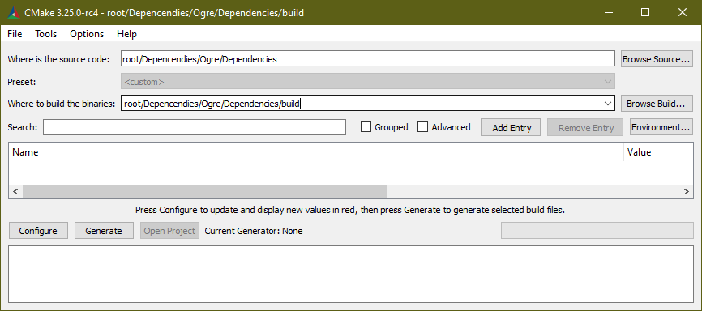
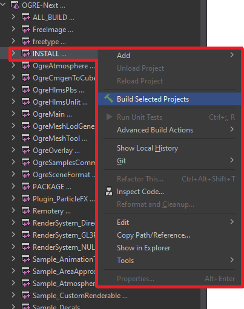

[//]: # (![Alt text]&#40;./Screenshots/pjatk/Logo_EN_1.png "Cookie Engine Screen"&#41;)
# Cookie Engine :cookie:
Wojciech Czerski - PJAIT - Engineering Thesis 

## How to install?
Create folder where you want to keep project, for example 
> root/..

Create Dependencies folder where you keep all additional libraries.
> root/Dependencies/..

Move there downloaded libraries ImGui, OGRE-next.

### OGRE

For OGRE and it's dependencies do build with this tutorial step-by-step

https://ogrecave.github.io/ogre-next/api/latest/_setting_up_ogre_windows.html#BuildingOgreWindows

Include SDL2 build library to Release folder in bin.
To run DirectX add amd_ags_x64.dll
Add Ogre Atmosphere.dll, resource.cfg to bin\release

Clear %AppData%/CookiEngine to clear run config witf resource.cfg

### ImGui

Works out-of-the-box. If not, please add CMakeLists with ImGui lib definition to Dependencies folder.
Then include it in main CMakeLists.

### Special thanks
For creating imgui integration files and implementation:
https://github.com/edherbert/ogre-next-imgui

### Execution build

After proper installation hit compile on release version. 
For more info / errors fix ping me in sections below.

## How it works

### What it includes

